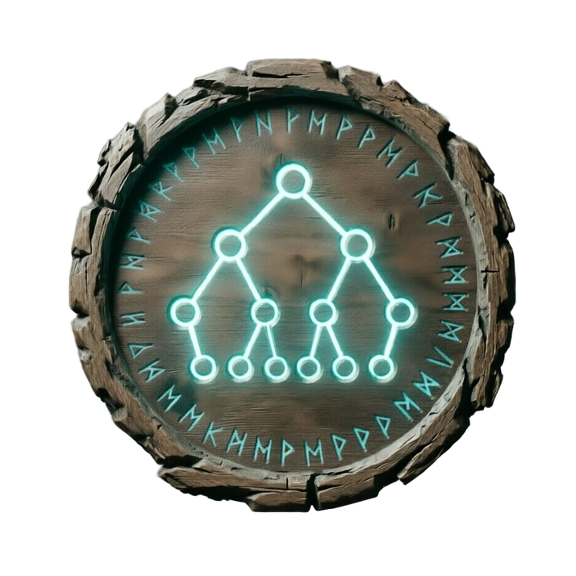

# skald

  
  
  **Динамическая система редактора конфигов диалогов и квестов для KGMarketPlace**

  
  
  

---

## 🇬🇧 English

### 📖 About the Project
**KGMarketPlace** is a comprehensive mod for Valheim that introduces a fully functional marketplace system, complete with interactive NPC dialogues and a quest system. 

To make the creation and management of complex dialogue trees and quest configurations as easy as possible, we have developed a dedicated **Web Utility Skald's Forge**. This tool allows modders and server admins to visually design interactions and export them directly into the `.cfg` files required by the mod.

### 🌟 Web Utility Features
*   **Visual Node Tree:** Design and view complex dialogue and quest connections in an intuitive, browser-based node editor.
*   **In-Game WYSIWYG Text Editor:** Format your dialogue text exactly as it will appear in the game. See colors, tags, and styling in real-time.
*   **Seamless Export:** Generate ready-to-use `.cfg` files with a single click. Just drop them into your mod configuration folder.
*   **Zero Setup:** Runs entirely in your browser. No need to install external software or learn complex configuration syntax.

#### Using the Web Utility (For Modders & Admins)
1. Open the [Skald's Forge Web Utility](https://enotinmax.github.io/skald/).
2. Create your dialogue nodes or quest steps using the visual tree.
3. Use the text editor to apply in-game formatting (e.g., rich text tags).
4. Click **Export** to download your `.cfg` file.
5. Place the generated `.cfg` file into `Valheim/BepInEx/config/KGMarketPlace/`.

### 🤝 Contributing
Contributions, issues, and feature requests are welcome! Feel free to check the [issues page](https://github.com/EnotinMax/skald/issues).

---

## 🇷🇺 Русский

### 📖 О проекте
**KGMarketPlace** — это масштабный мод для Valheim, который добавляет полноценную систему маркетплейса, включая интерактивные диалоги с NPC и систему квестов.

Чтобы сделать создание и управление сложными деревьями диалогов и настройками квестов максимально простым, мы разработали специализированную **Веб-утилиту Кузница Скальда**. Этот инструмент позволяет мододелам и администраторам серверов визуально проектировать взаимодействия и экспортировать их напрямую в `.cfg` файлы, необходимые для работы мода.

### 🌟 Возможности веб-утилиты
*   **Визуальное дерево связей:** Проектируйте и просматривайте сложные ветки диалогов и квестов в интуитивном визуальном редакторе прямо в браузере.
*   **Визуальный редактор текста (WYSIWYG):** Форматируйте текст диалогов точно так, как он будет отображаться в игре. Видьте цвета, теги и стилизацию в реальном времени.
*   **Бесшовный экспорт:** Генерируйте готовые `.cfg` файлы одним нажатием кнопки. Просто перенесите их в папку с конфигурациями мода.
*   **Без лишних установок:** Работает полностью в вашем браузере. Не нужно устанавливать сторонний софт или изучать сложный синтаксис конфигураций.

#### Использование веб-утилиты (Для мододелов и админов)
1. Откройте [Веб-утилиту Кузница Скальда](https://enotinmax.github.io/skald/).
2. Создайте ноды диалогов или шаги квестов, используя визуальное дерево.
3. Используйте текстовый редактор для применения внутриигрового форматирования (например, теги форматированного текста).
4. Нажмите **Экспорт**, чтобы скачать ваш `.cfg` файл.
5. Поместите сгенерированный `.cfg` файл в папку `Valheim/BepInEx/config/KGMarketPlace/`.

### 🤝 Участие в разработке
Мы приветствуем вклад, сообщения об ошибках и предложения новых функций! Загляните на страницу [issues](https://github.com/EnotinMax/skald/issues).

---

  OdinSons Team

Use Control + Shift + m to toggle the tab key moving focus. Alternatively, use esc then tab to move to the next interactive element on the page.
Attach files by dragging & dropping, selecting or pasting them.
